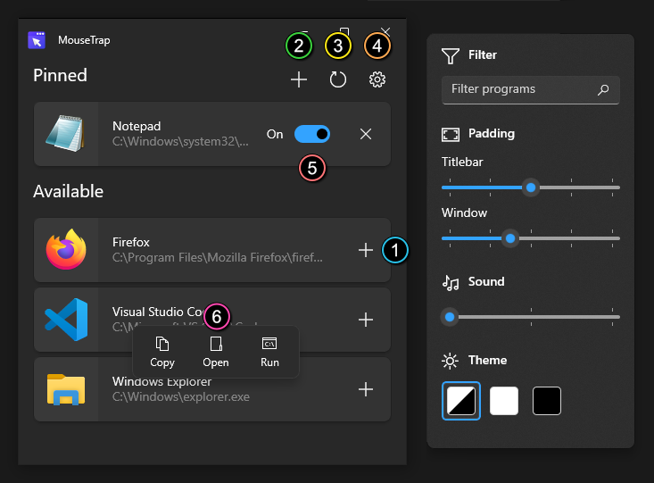

<h1 align="center">
MouseTrap
</h1>

<h4 align="center">
A Windows app that restricts the mouse cursor to a window.
</h4>

	
	
	
	

## Download

MouseTrap can be downloaded from the [releases page][releases]. 

[.NET 8.0][net8] and [Windows App SDK 1.5][winapp] runtimes are required.

## Preview

<video src="https://github.com/Temetra/MouseTrap/assets/1958965/d04b9c39-4a96-4a81-a573-88b9b4da1813"></video>

## Usage

1. Pin programs to enable cursor trapping.
1. Or find a program to add to the pinned list.
1. Refresh available programs.
1. Filter programs from the `Settings` menu.
1. Toggle trapping for pinned programs.
1. Context menu has additional functions.

### Hotkeys

* <kbd>F5</kbd> - Refresh
* <kbd>Ctrl</kbd>+<kbd>N</kbd> - Add program

## Details

* This is a WinUI 3 application.
* Designed and tested on Windows 10.
* Compatible with Windows 11.
* Requires [.NET 8.0][net8] and [Windows App SDK 1.5][winapp].

[net8]: https://dotnet.microsoft.com/en-us/download
[winapp]: https://learn.microsoft.com/en-us/windows/apps/windows-app-sdk/downloads
[releases]: https://github.com/Temetra/MouseTrap/releases
